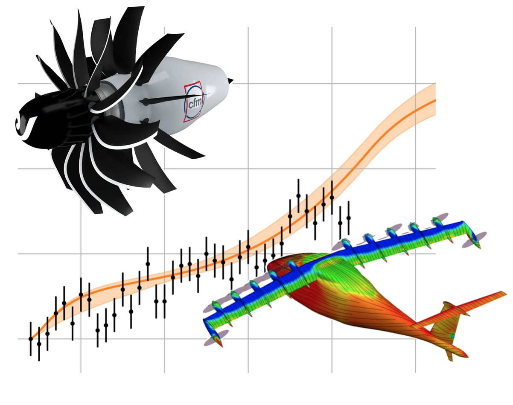

# Sustainable Aircraft Propulsion — Exercises

  

Welcome to the companion repository for the **Sustainable Aircraft Propulsion** course.

Here you will find:

- Python scripts and Jupyter notebooks organized by chapter
- Installation instructions and a reproducible environment
- Exercise pages describing what to run and what to learn

Use the navigation menu to start with **Setup**, then go to the chapter you are currently covering in class.
